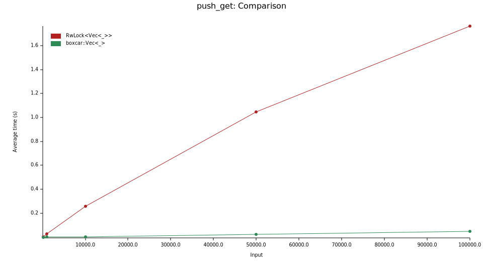

# Boxcar

[](https://crates.io/crates/boxcar)
[](https://github.com/ibraheemdev/boxcar)
[](https://docs.rs/boxcar)

A concurrent, append-only vector.

The vector provided by this crate suports concurrent `get` and `push` operations.
Reads are always lock-free, as are writes except when resizing is required.

# Examples

Appending an element to a vector and retrieving it:

```rust
let vec = boxcar::Vec::new();
vec.push(42);
assert_eq!(vec[0], 42);
```

The vector can be shared across threads with an `Arc`:

```rust
use std::sync::Arc;

fn main() {
    let vec = Arc::new(boxcar::Vec::new());

    // spawn 6 threads that append to the vec
    let threads = (0..6)
        .map(|i| {
            let vec = vec.clone();

            std::thread::spawn(move || {
                vec.push(i); // push through `&Vec`
            })
        })
        .collect::<Vec<_>>();

    // wait for the threads to finish
    for thread in threads {
        thread.join().unwrap();
    }

    for i in 0..6 {
        assert!(vec.iter().any(|&x| x == i));
    }
}
```

Elements can be mutated through fine-grained locking:

```rust
use std::sync::{Mutex, Arc};

fn main() {
    let vec = Arc::new(boxcar::Vec::new());

    // insert an element
    vec.push(Mutex::new(1));

    let thread = std::thread::spawn({
        let vec = vec.clone();
        move || {
            // mutate through the mutex
            *vec[0].lock().unwrap() += 1;
        }
    });

    thread.join().unwrap();

    let x = vec[0].lock().unwrap();
    assert_eq!(*x, 2);
}
```

# Details

A vector is represented as an array of lazily allocated buckets, sizes 1, 1, 2, 4 .. 2^63:

```text
______________________________________
|  |  |    |        |                |
|  |  |    |        |                |
--------------------------------------
```

A buckets holds a number entries, as well as a lock used for initialization:

```text
_____________
|  |  |  |  |
|  |  |  |  |
-------------
| UNLOCKED  |
-------------
```

An entry holds a slot for a value along with a flag indicating whether the slot is active:

```text
_____________________
| ACTIVE | INACTIVE |
|   42   |   NULL   |
--------------------
```

Writes to the vector acquire a unique entry index. The bucket holding the entry is calculated using the leading zeros instruction. If the bucket is already initialized, the value is simply written to the slot, and the slot is marked as active. If the bucket has not been initialized, the thread acquires the initialization lock, allocates the bucket, and then writes the value. Note that in the general case, writes are lock-free.

Reads use the same calculation to find the slot mapped to the given index, reading the value from the slot if the flag indicates the slot is active. All reads are guaranteed to be lock-free.

# Performance

Below is a benchmark where an increasing number of elements are pushed and read from the vector, comparing `boxcar::Vec` to a `RwLock<Vec>`:



The results show that `boxcar::Vec` scales very well under load, performing significantly better than lock-based solutions.
